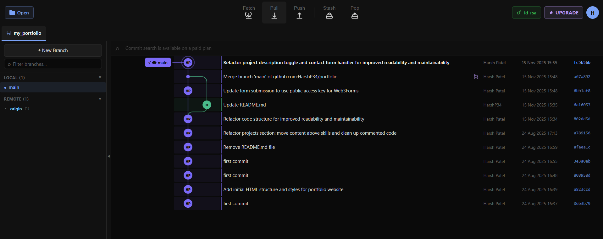

# Git Graph UI

A free desktop Git client for Windows — visual commit graph, split diff viewer, conflict resolver, staging, branching, and remote operations. Everything runs **locally** on your machine; your repos never leave your PC.

> This repository contains **release downloads only** (installers and update metadata). Source code is not published here.

---

## Download

**Latest version (recommended):**

[](https://github.com/HarshP34/git-graph-ui-releases/releases/latest)

**Direct installer link** — replace the version in the URL after each release, or use the latest release page to copy the exact filename:

```
https://github.com/HarshP34/git-graph-ui-releases/releases/latest/download/Git.Graph.UI.Setup.1.1.4.exe
```

### System requirements

- Windows 10 or later (64-bit)
- [Git for Windows](https://git-scm.com/download/win) installed (for SSH and git commands)

### Install

1. Download the `.exe` from [Releases](https://github.com/HarshP34/git-graph-ui-releases/releases/latest).
2. Run the installer and follow the prompts.
3. Open **Git Graph UI** from the Start menu or desktop shortcut.
4. Click **Open Folder** and choose a folder that contains a `.git` directory.

The app checks this repo for updates automatically when a newer version is published.

---

## Screenshots

### Git graph



---

## Features

- **Visual commit graph** — branch lanes, colors, live refresh over WebSocket
- **Staging & commit** — stage, unstage, discard; `Ctrl+Enter` to commit
- **Split diff viewer** — side-by-side hunks, full-file mode, minimap
- **Conflict resolver** — Ours vs. Theirs with accept/reject per conflict
- **Branching** — checkout, create, delete, merge, rebase
- **Remotes** — fetch, pull, push, stash; safe force-push prompts
- **Themes** — Tokyo Night, Dracula, One Dark, GitHub Dark, and more
- **Local-first** — no account required for the free tier

---

## Free tier

The public download includes:

- Up to **100 commits** of history in the graph
- Checkout, merge, revert, push/pull, conflicts, diff, stash
- Core workflow features for everyday Git use

---

## Updates

New versions are published on the [Releases](https://github.com/HarshP34/git-graph-ui-releases/releases) page. Installed apps notify you when an update is available and can download and install it from this repository.

To see what changed, open the release notes on each version tag.

---

## Support & feedback

- **Website:** *(add your website URL here)*
- **Contact:** *(add your contact form or email here)*
- **Issues:** use GitHub Issues on this repo for bugs and feature requests related to the **released app**

---

## Privacy

Git Graph UI runs a small local server on your machine to talk to Git. It does not upload your repository contents to the cloud. Network access is used only for optional features you enable (e.g. `git push` / `git pull` to your remotes).

---

## License

*(Add your license here, e.g. MIT — or “All rights reserved” for a proprietary free download.)*

---

<p align="center">
  <sub>Release artifacts only · Built with Electron</sub>
</p>
